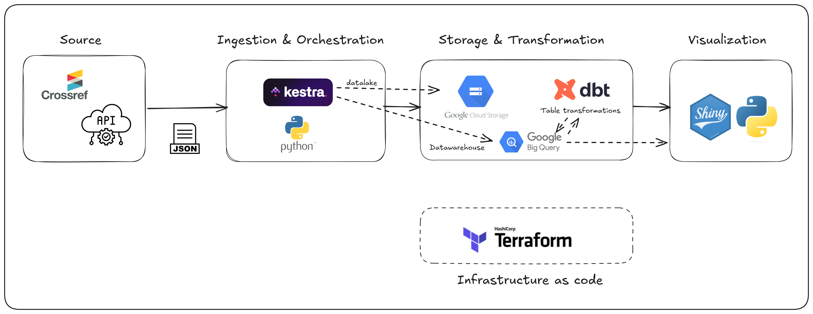
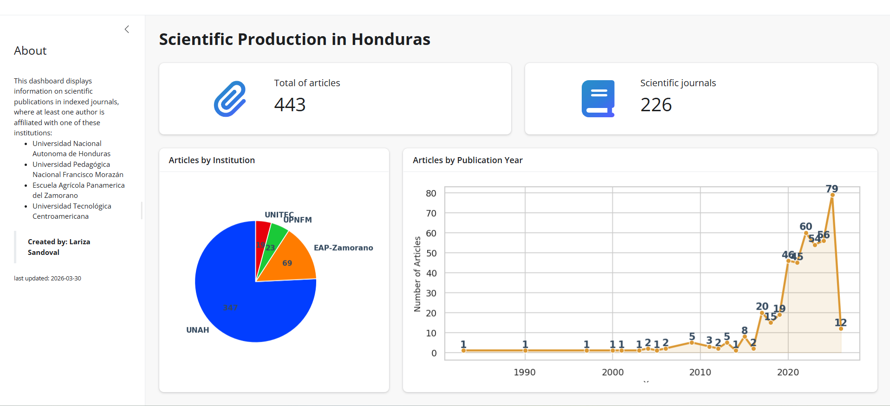

## Scientific Production in Honduras Data Pipeline


This project was developed as a final project of the [Data Engineering Zoomcamp Cohort 2026](https://github.com/DataTalksClub/data-engineering-zoomcamp) where the goal is to apply everything we have learned in the course to build an end-to-end data pipeline.

---

### Problem Statement

Honduras is a small Central American country with a growing intellectual development distributed across its academic and research centers. However, this generated knowledge faces a barrier of dispersion. There is a critical disconnect between the generation of science and its monitoring. Lacking an infrastructure to centralize, standardize, and analyze these publications, the country suffers from statistical invisibility regarding articles published in scientific journals.

This project aims to build a data pipeline and transform it into actionable insights, visualizing key metrics such as: 
* **The volume of publications per year** and
*  **The distribution by participating institucion**

---

### Data source and Data set
The dataset comes from the [Crossref](https://www.crossref.org/) database, which is the world's largest registry of [DOIs (Digital Object Identifiers)](https://es.wikipedia.org/wiki/Identificador_de_objeto_digital). 
Crossref provides a [REST API](https://www.crossref.org/documentation/retrieve-metadata/rest-api/).  So about the dataset: 
- Nature: Semi-structured data (JSON).
- Extraction Filter: Scientific articles where at least one author's **affiliation** is some of the following academic institutions:
    * Universidad Nacional Autonoma de Honduras (UNAH)
    * Universidad Pedagógica Nacional Francisco Morazán (UPNFM)
    * Escuela Agrícola Panamerica del Zamorano 
    * Universidad Tecnológica Centroamericana (UNITEC)
Fields of interest:
* DOI: The article's unique identifier (our Primary Key).
* Title: Article title (can be in English or Spanish).
* Published-Print / Published-Online: Publication dates.
* Author (Nested JSON): A nested list containing the authors' names and, their affiliations, among others.

--- 
### Pipeline Architecture & Tech Stack
This architecture was followed using this tools:


| Layer         |      Tool     |  Role |
| ------------- | :-----------: | :----: |
| Infrastructure (IaC)	| Terraform | Cloud Provisioning: Automatically define and create Buckets, Datasets, and Permissions (IAM) in GCP. |
| Ingestion   | Python  | API Extraction consuming the Crossref API
|  Orchestration    |  Kestra    | Workflow Manager. Executes the Python script,   and load the data into the bucket and create a raw table in the bigquery dataset |
| Storage (Load) | Google Cloud Storage | Data Lake Object repository where the original .json files are stored as a backup |
| Datawarehouse | Google BigQuery  |  Analytics Storage. Engine where the data resides. Supports JSON processing and bulk SQL queries. |
|Transformation | dbt  | Data Modeling Cleans, normalizes, and unifies tables, generete final factable for consumption   |
|Visualization| Shiny for python | BI / Dashboarding Interactive web interface that displays insightful charts

--- 
### Directory Project Structure

```
DEZoomCampProject
├── 1-infra-terraform                           #Cloud infrastructure
│   ├── main.tf
│   └── variables.tf
├── 2-orchestration-kestra                      
│   ├── flow.yml                                #Kestra flow to extract and load data into the bucket and create the raw data table
│   ├── extract_science_production_data.py      #Python script for extraction from api ifself
├── 3-tranform-dbt                              #dbt transformation
│   └── science_production
│       ├── dbt_project.yml
│       ├── profiles.yml
│       ├── models
│       │   ├── marts
│       │   │   └── ftc_science_production.sql  #Final tables with all articles
│       │   └── staging
│       │       ├── source.yml                  #BigQuery raw data table
│       │       ├── stg_afiliations.sql         #Table with desired affiliation 
│       │       └── stg_works.sql               #Table with articles from desired affiliation
├── 4-visualization-shiny
│   └── dashboard
│       ├── app.py                              #Main python file for shiny application
│       ├── requirements.txt                    #Requirement for python and shiny
│       ├── shared.py                           #File path management for the shiny application
│       └── styles.css                          #Visual styles for applicacion
```

---
### Dashboard

The dashboard was developed using [**Shiny for Python**](https://shiny.posit.co/py/), a fantastic and fast tool!

First, a connection was established to the data source using a Service Account to communicate with BigQuery. The `fct_science_production` table was queried, where the data is clean and normalized.

You can see a live demo here: [Scientific Production in Honduras](https://lariza.shinyapps.io/science_produccion_hn/)
We can see the following metrics:
* Number of articles whose authors are affiliated with the academic institutions of interest.
* Number of journals in which these articles are published.
* Articles distributed by institution.
* Number of articles published per year.


---
### Reproducibility

##### 1. Terraform - Infrastructure in Google Cloud
Create a service account in the GCP console with Editor or Owner roles, download the .json file and reference it in your code. Or use Application Default Credentials (ADC) for working locally running `gcloud auth application-default login` command.

Then run the basic commands:

`terraform init`
`terraform plan`
`terraform apply`

##### 2. Kestra - Orchestration flow

With Kestra installed, either by container or locally, do the following:
1. Upload the [`flow.yml`](/2-orchestration-kestra/flow.yml) this create the namespace `project`
2. Define the following _key:value_ pair in namespace `project`:
  they are the google cloud variables needed to connect to Google Cloud. `The ID project, the bucket name, the dataset` are most important.
3. Then add the Python script [`extract_science_production_data.py`](/2-orchestration-kestra/extract_science_production_data.py) to the project namespace.

4. Execute the [`flow.yml`](/2-orchestration-kestra/flow.yml) flow.

##### 3. dbt - Transformation

Place in  [`dbt project folder`](/3-tranform-dbt/science_production/)

Make sure to place the Google Cloud `key` and `project` values ​​in [`profiles.yml`](/3-tranform-dbt/science_production/profiles.yml) file

Run the following commands:
 `dbt debug --profiles-dir .`

`dbt deps`

`dbt run --profiles-dir .`

##### 4. Visualization - Shiny for python

Place in [`4-visualization-shiny/dashboard`](/4-visualization-shiny/dashboard/) folder

Make sure you have the `.json` key to connect with BigQuery in the folder and name it `credentials.json` or change the name in [`shared.py`](/4-visualization-shiny/dashboard/shared.py) file.

Run the following commands to run the shiny app locally:

`pip install -r requirements.txt`

`shiny run app.py`

---

### Future improvements

The pipeline has many opportunities for improvement, including the following:
* At problem and objectives level:
    - Review the query to ensure it's correct, as the data is currently insufficient.
    - Add more Honduran institutions, such as more universities.
    - Review the number of publications per author.
    - Review the area of ​​study of the scientific article.

* At technical level:
    - Automate the execution of the flow in Kestra to run at specif intervals
    - Automate the dbt project.
    - Review the data source, as the python script that consumes the CrossRef API can be improved.
    - Review the Data Warehouse tables and add the author and fields dimension.
